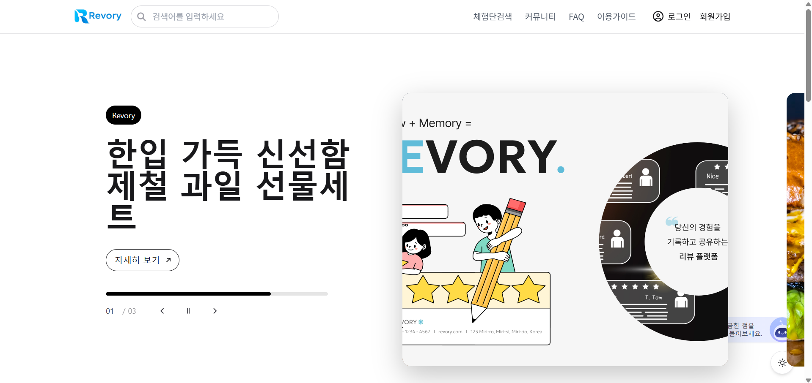

<h1 align="center">🧪 체험단 중개 플랫폼 - Revory</h1>

  리뷰어와 소상공인을 연결하는 리뷰 기반 마케팅 플랫폼  

  
  
  
  
  
  

---

## 📌 프로젝트 소개

> **체험단 리뷰 플랫폼**  
> 리뷰어가 자신의 채널을 등록하고, 소상공인이 체험단을 모집하여 홍보할 수 있는 플랫폼입니다.  
> 회원 유형(리뷰어/소상공인/관리자)에 따라 권한과 프로필이 분리되며, 실명 기반의 가입과 이메일 인증을 통해 신뢰 기반의 커뮤니티를 형성합니다.

---

## 🔧 기술 스택

| Layer      | Stack                          |
|------------|-------------------------------|
| Backend    | Spring Boot, Java 17, MyBatis, MySQL, Spring Security, JWT |
| Frontend   | React 18, Vite, Tailwind CSS, Axios, React Query |
| Infra      | MySQL 8.x, Gradle, GitHub, Postman |

---

---

## 🧩 핵심 기능 요약

- ✅ 리뷰어/소상공인 통합 회원가입 구조 (`TB_MEMBER` + 권한 분리)
- ✅ JWT 로그인 + 토큰 기반 인증 시스템
- ✅ 다중 권한 지원 (`ROLE_USER`, `ROLE_OWNER`, `ROLE_ADMIN`)
- ✅ 리뷰어 유형별 채널 정보 등록 (Blog / YouTube / Insta 등)
- ✅ 이메일 인증 후 회원가입
- ✅ 회원 프로필/소개/주소는 가입 후 단계별 등록
- ✅ 리뷰어 채널은 공통코드 기반 관리 (`TB_COMMON_CODE`)

---

## 🔐 인증 구조
추가 예정

---

## MainPage

  

---
